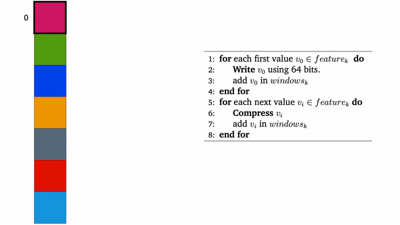
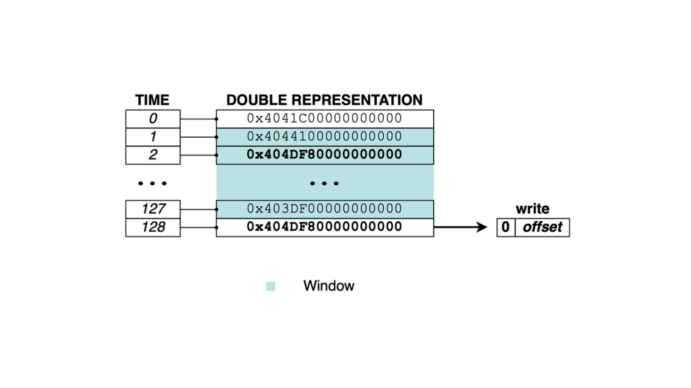
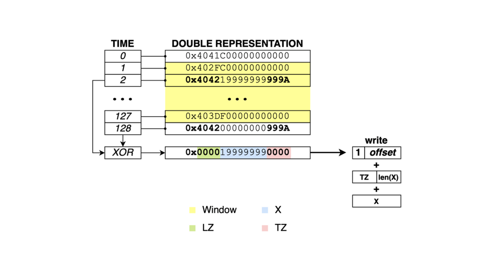
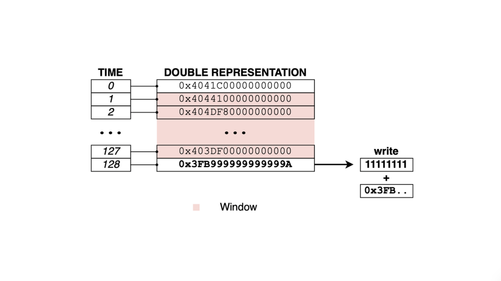

# TSXor: A Simple Time Series Compression Algorithm

Developed @ ISTI CNR - [HPC Lab](http://hpc.isti.cnr.it) (Pisa)

Full paper [here](https://rossanoventurini.github.io/papers/SPIRE21.pdf)

# Code

* [Introduction](#introduction)
* [How it works](#how_it_works)
* [Building the code](#building-the-code)
* [Input data format](#input-data-format)
* [Run](#run)
* [Benchmarks](#benchmarks)
* [Authors](#authors)
* [Notes](#notes)

Introduction
-----------------
TSXor, a simple yet effective encoder/decoder for time series that achieves high compression ratios and fast decompression speed. TSXor exploits the redundancy/similarity between close-in-time values through a window that acts as a cache.

How it works
-----------------
### Window
TSXor compares each _vn_ value with its preceding _W ≤ 127_ values, logically corresponding to the values seen in the time range _[tn−W , tn−1]_. The goal is to compress _vn_ relative to this “window” containing the previous _W_ values. We distinguish between 3 cases, namely **Reference**, **XOR**, and **Exception**.

    

### Reference
If _vn_ is equal to a value in the window, just output its position _p_ in the window. Since the window contains at most 127 values, 1 byte suffices to write the position with the most significant bit always equal to 0.

    

If the window does not contain _vn_, then we search for the value _u_ in the window such that _x = vn_ ⨁ _u_ has the largest number of leading (LZ) and trailing (TZ) zeros bytes. Let _p_ be the position of _u_ in the window. We first write _p + 128_ using 1 byte. In this case the most significant bit will always be 1 because of sum, which allows us to distinguish this case from the **Reference** case.

### XOR
If _LZ +TZ ≥ 2_, we output a byte where 4 bits are dedicated to TZ and the other 4 bits to the length (in bytes) of the segment of x between the leading and trailing zero bytes. We then write such middle bytes.

    

### Exception
We output an exception code, i.e., the value 255 using 1 byte, followed by the plain double-precision representation of _vn_ using 8 bytes.

    

Builiding the code
-----------------
The code has been tested both on Linux and MacOS.

No dependencies are needed.

Just clone this repo and execute:

    make all

Input data format
-----------------
The algorithm can process any `.csv` file containing numbers only.
You need first to convert the `.csv` into a `.bin` file using the `csv_to_bin` utility as follows:

    cd util

    ./csv_to_bin.o path/to/MY_DATASET.csv

Please note: the first column will be interpreted as the timestamp, the rest will be interpreted as values.

Run
-----------------
### Compression

To run a compression test of a `.bin` file, execute the following commands:

    cd test

    ./compression.o path/to/MY_DATASET.bin

This will produce a file called ``compressed_data.tsx``

### Decompression

To decompress the file ``compressed_data.tsx``, run the command:

    ./decompression.o

Benchmarks
-----------------
The following tables show the comparison between TSXor with respect to [Gorilla](https://www.vldb.org/pvldb/vol8/p1816-teller.pdf) by Facebook and [FPC](https://ieeexplore.ieee.org/document/4589203) by Burtscher and Ratanaworabhan. The experiments were run on an Ubuntu 18.04 machine with Intel i7-7700 CPU @ 3.60GHz.

### Compression Speeds (MB/s)

|                      |  FPC  | Gorilla | TSXor |
|:--------------------:|:-----:|:-------:|:------:|
|        AMPds2        | 339,28 | **703,72** | 66,59 |
|       Bar Crawl      | 423,71 | **466,49** | 28,74 |
|      Max-Planck      | 313,40 | **870,58** | 51,74 |
|        Kinect        | 166,28 | **696,10** | 17,14 |
|      Oxford-Man      | 170,27 | **630,33** | 15,43 |
|         PAMAP        | 181,59 | **521,41** | 45,05 |
| UCI Gas Sensor Array | 286,94 | **654,32** | 21,93 |

### Decompression Speeds (MB/s)

|                      |   FPC   | Gorilla |  TSXor |
|:--------------------:|:-------:|:-------:|:-------:|
|        AMPds2        | 411,29 | 666,52 | **1173,65** |
|       Bar Crawl      | 436,12 | 447,42 | **709,68**  |
|      Max-Planck      | 355,30 | 858,68 | **1057,00** |
|        Kinect        | 287,18 | 635,74 | **665,47**  |
|      Oxford-Man      | 221,80 | 573,67 | **604,54**  |
|         PAMAP        | 223,86 | 487,41 | **949,28**  |
| UCI Gas Sensor Array | 454,91 | 578,41 | **642,40**  |

### Compression Ratios

|                      |   FPC  | Gorilla | TSXor |
|:--------------------:|:------:|:-------:|:------:|
|        AMPds2        | 1,10x | 2,03x | **6,39x** |
|       Bar Crawl      | 1,20x | 1,44x | **2,36x** |
|      Max-Planck      | 1,06x | 2,97x | **4,84x** |
|        Kinect        | 1,09x | **1,41x** | 1,37x |
|      Oxford-Man      | 1,06x | 1,28x | **1,30x** |
|         PAMAP        | 1,01x | 1,38x | **4,85x** |
| UCI Gas Sensor Array | 1,19x | 1,23x | **3,50x** |

Authors
-----------------
* [Andrea Bruno](https://github.com/andybbruno)
* [Franco Maria Nardini](http://hpc.isti.cnr.it/~nardini/)
* [Giulio Ermanno Pibiri](http://pages.di.unipi.it/pibiri/)
* [Roberto Trani](https://github.com/roberto-trani)
* [Rossano Venturini](http://pages.di.unipi.it/rossano/)

Notes
-----------------
This is a beta version. Use it at your own risk.

